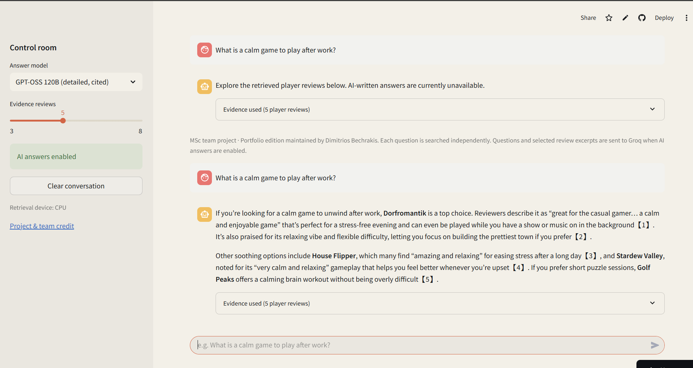
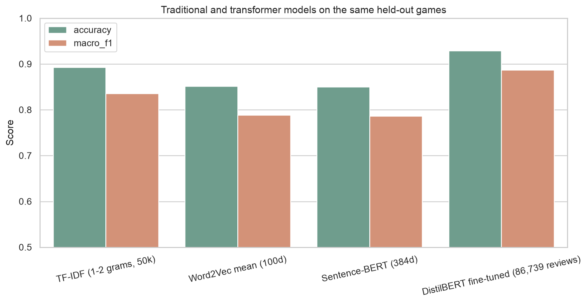

# Steam Reviews — NLP, Explainability & RAG

[](https://github.com/dbechrakis/steam-reviews-nlp-rag/actions/workflows/evidence.yml)

An end-to-end **customer-feedback analytics** project using a **120,000-review modelling sample** from **843,094 prepared English reviews** to classify sentiment, discover themes, perform semantic search, explain model predictions, and build a retrieval-augmented Q&A system.

The project demonstrates how unstructured customer feedback can be transformed into **measurable signals and an interactive decision-support workflow**.

## Live application

**[Open the Steam Game Review Explorer →](https://dbechrakis-steam-explorer.streamlit.app/)**

[](https://dbechrakis-steam-explorer.streamlit.app/)

Search a curated corpus of **41,170 reviews across 241 games**. The application retrieves and reranks relevant player evidence, then uses **GPT-OSS 120B through Groq** to produce an answer with numbered citations. The evidence remains inspectable if generation is temporarily unavailable.

## Business questions

- What is the overall sentiment of player feedback?
- Which themes appear repeatedly across reviews?
- Can similar reviews be retrieved semantically rather than by keyword alone?
- Which features drive sentiment predictions?
- Can a grounded RAG system answer questions using the review corpus as evidence?

## Key results

### Sentiment classification

The DistilBERT fitting subset contains 86,739 reviews; the shared held-out-game test set contains 24,342. These are different populations, not alternative total dataset sizes. [Sample accounting](outputs/tables/full_data_and_sample_summary.csv).

| Model / representation | Accuracy | Macro F1 |
|---|---:|---:|
| TF-IDF | 89.3% | 0.836 |
| Word2Vec | 85.1% | 0.789 |
| Sentence-BERT | 85.0% | 0.786 |
| **Fine-tuned DistilBERT** | **92.9%** | **0.887** |

The original representation comparison uses different text preprocessing for TF-IDF/Word2Vec and Sentence-BERT. The saved same-text TF-IDF control reaches **90.12% accuracy / 0.8484 macro F1**; see [controlled comparison](outputs/tables/embedding_comparison_controlled.csv). These comparisons do not isolate model architecture alone.



### RAG evaluation

The saved Llama run contains **17/18 recognized game-name mentions present in retrieved evidence**, across **five prompts**. This is a name-presence check, not answer-level factuality or claim-level groundedness. It can miss invented names absent from the corpus and cannot detect unsupported claims about a correctly named game.

[Recorded generator counts](outputs/tables/rag_model_comparison.csv) · [Evaluation implementation](05_RAG_System.ipynb)

These are recorded historical results; training and live generation have not been rerun in this review.

## My contribution

The original notebooks identify me (Mitsos / Dimitrios Bechrakis) as owner of:

- **Notebook 03:** document embeddings, representation comparison and semantic search.
- **Notebook 04:** DistilBERT fine-tuning, held-out-game evaluation and SHAP explanations.
- **Notebook 05:** two-stage retrieval, RAG evaluation and application artifact export.

This attribution follows the notebook ownership notes; it does not imply sole authorship of the complete project.

## Analytics workflow

```text
Raw Reviews
    ↓
Cleaning & Language Detection
    ↓
EDA / TF-IDF / Embeddings
    ↓
Semantic Search + Topic Modelling
    ↓
DistilBERT Sentiment Classification
    ↓
SHAP Explainability
    ↓
FAISS Retrieval
    ↓
RAG Q&A Application
```

## Project components

| Component | Purpose |
|---|---|
| Data preparation | Cleaning, language detection and normalization |
| Text analytics | TF-IDF, word frequencies and exploratory analysis |
| Embeddings | Word2Vec and Sentence-BERT semantic representations |
| Classification | DistilBERT sentiment model and baselines |
| Explainability | SHAP analysis of model behaviour |
| Topic modelling | LDA-based discovery of recurring themes |
| Retrieval | FAISS semantic search over review embeddings |
| RAG | Grounded Q&A over the review corpus |
| Application | Streamlit interface for interactive exploration |

## Visual analysis

The repository includes confusion-matrix, embedding, SHAP and topic-modelling outputs under `outputs/figures/`.

## Tech stack

**Python · PyTorch · Hugging Face Transformers · DistilBERT · Sentence-Transformers · FAISS · SHAP · Gensim · scikit-learn · Streamlit**

## Reproducibility

### Interactive application

The Streamlit app is [deployed publicly](https://dbechrakis-steam-explorer.streamlit.app/). The
[deployment guide](DEPLOYMENT.md) documents the entrypoint `deploy/streamlit_app.py`
and the reproducible setup.
It automatically fetches the original team's matching retrieval artifacts from
[Nebuchedeser's Space](https://huggingface.co/spaces/Nebuchedeser/steam-game-review-explorer)
at a fixed, integrity-checked revision. That source application was paused when
inspected; its public files remain the source for this portfolio edition.
Without a Groq key, the application can still expose retrieved reviews. The public
deployment uses a server-side key and the verified GPT-OSS model for answers with
prompted citations; visitors never enter or see that credential.

[Input files and execution order](REPRODUCING.md)

The notebooks include their generated outputs for review. The raw Kaggle dataset and the large FAISS index are intentionally excluded from the repository. A Groq API key is required for the RAG generation layer.

Never commit API credentials or `.env` files.

## Context

Applied NLP portfolio case study developed during an MSc Data Science programme at **The American College of Greece**. The academic context is retained for transparency; the repository is presented around the analytical problem, methodology, results and application.

## Author

**Dimitris Bechrakis**  
Business & Data Analyst | M.Sc. Data Science

## Licensing

See [licensing scope](LICENSING.md) for the MIT-licensed verification code and the separately governed project materials.
