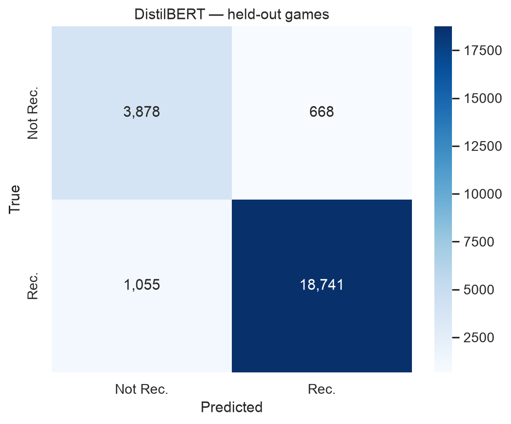
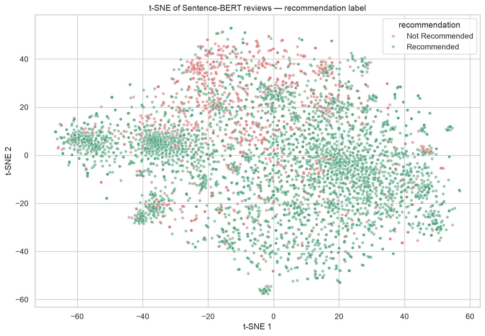
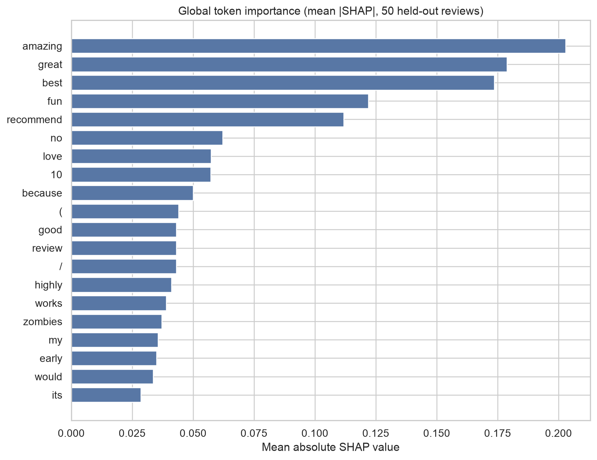
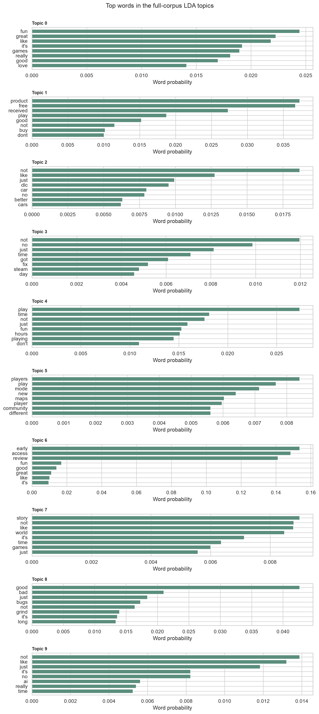

# Steam Game Reviews — NLP, DistilBERT & RAG Pipeline

End-to-end NLP project on ~87K Steam game reviews: sentiment classification, semantic search, an explainable DistilBERT classifier, topic modelling, and a RAG-based Q&A system over the review corpus.

M.Sc. Data Science group project (ITC — NLP course). Built with Python, PyTorch, Hugging Face Transformers, FAISS, and Streamlit.

## What's in here

| Notebook | What it does |
|---|---|
| `00_Full_Data_Preparation` | Cleans and merges the raw Kaggle review/game datasets |
| `01_Data_Loading_and_Preprocessing` | Tokenization, language detection, text normalization |
| `02_Feature_Engineering_and_Text_Visualization` | TF-IDF, word frequency, EDA visualizations |
| `03_Document_Embeddings_and_Semantic_Analysis` | Word2Vec, Sentence-BERT embeddings, semantic similarity |
| `04_DistilBERT_Classifier_and_XAI` | Fine-tuned DistilBERT sentiment classifier + SHAP explainability |
| `05_RAG_System` | Retrieval-augmented Q&A over the review corpus (FAISS + Groq LLMs) |
| `06_Topic_Modelling` | LDA topic modelling across the review set |

`app.py` / `rag_backend.py` — Streamlit app serving the RAG system as an interactive Q&A demo.

## Key results

**Sentiment classification** — fine-tuned DistilBERT clearly outperforms classical baselines:

| Representation | Accuracy | Macro F1 |
|---|---|---|
| TF-IDF (1-2 grams) | 89.3% | 0.836 |
| Word2Vec (mean, 100d) | 85.1% | 0.789 |
| Sentence-BERT (384d) | 85.0% | 0.786 |
| **DistilBERT (fine-tuned, 86.7K reviews)** | **92.9%** | **0.887** |

**RAG groundedness** — of two candidate LLMs tested for answer generation, Llama-3.3-70B produced 17/18 grounded (non-hallucinated) answers on the eval set, vs. 7/8 for GPT-OSS-120B.

## A few visuals






More figures in [`outputs/figures/`](outputs/figures/) — class balance, embedding comparisons, PCA/t-SNE projections, top positive/negative words, and topic prevalence.

## Tech stack

Python · PyTorch · Hugging Face Transformers (DistilBERT) · Sentence-Transformers · FAISS · SHAP · Gensim (LDA) · scikit-learn · Streamlit · Groq API (Llama-3.3-70B for RAG generation)

## Running it locally

The notebooks already contain their outputs — nothing needs to be re-run just to review the work. To reproduce:

```bash
pip install torch faiss-cpu sentence-transformers transformers datasets \
    scikit-learn pandas matplotlib seaborn shap gensim \
    groq python-dotenv langdetect accelerate streamlit pyLDAvis
```

You'll also need the raw Kaggle Steam reviews dataset (not included here — too large) and a free [Groq API key](https://console.groq.com) for the RAG notebook and Streamlit app.

> Note: the FAISS index and full review corpus used by the RAG backend (~100MB) are excluded from this repo for size reasons. `outputs/tables/` has the evaluation results referenced above.

## Author

Dimitris Bechrakis — M.Sc. Data Science, The American College of Greece · [GitHub](https://github.com/dbechrakis)
