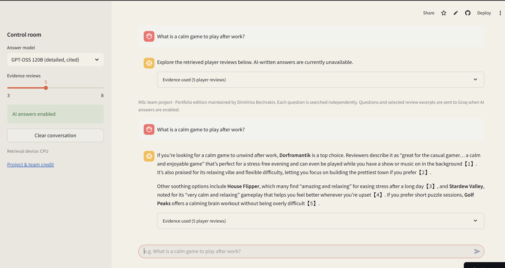
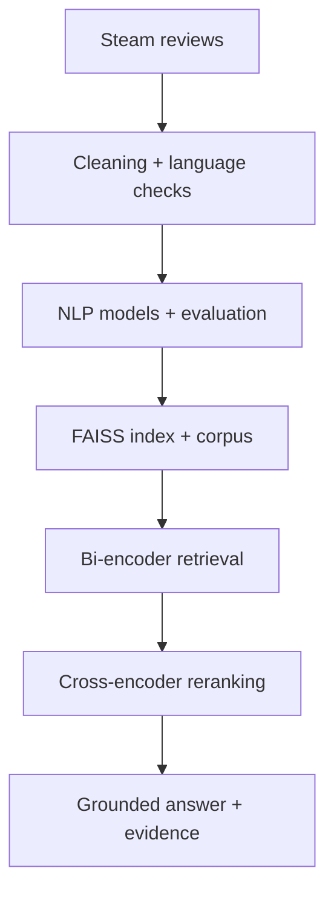
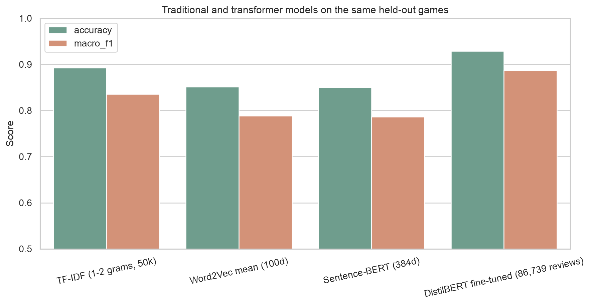

# Steam Review Intelligence — NLP, Explainability & RAG

[](https://github.com/dbechrakis/steam-reviews-nlp-rag/actions/workflows/evidence.yml)

An end-to-end NLP product that transforms large-scale Steam player feedback into sentiment signals, semantic retrieval, explainability, topic analysis, and evidence-grounded answers.

**Stack:** Python · PyTorch · Transformers · Sentence-Transformers · FAISS · SHAP · Groq · Streamlit

## Live product

**[Open the Steam Game Review Explorer →](https://dbechrakis-steam-explorer.streamlit.app/)**

[](https://dbechrakis-steam-explorer.streamlit.app/)

The application searches a curated corpus of **41,170 reviews across 241 games**. It retrieves semantic candidates, reranks them for relevance, and can generate an answer with numbered review citations through GPT-OSS 120B. Retrieved evidence remains visible when generation is unavailable.

## Business problem

Large review collections are difficult to use for decisions because feedback is unstructured, repetitive, and spread across many products. This project asks how player feedback can be converted into inspectable evidence for questions such as:

- What is the overall sentiment of player feedback?
- Which themes recur across positive and negative reviews?
- Can relevant reviews be found semantically instead of through keyword matching?
- Which text features influence sentiment predictions?
- Can generated answers remain traceable to real player evidence?

## Product architecture


```mermaid
flowchart TD
    A["Steam reviews"] --> B["Cleaning + language checks"]
    B --> C["NLP models + evaluation"]
    C --> D["FAISS index + corpus"]
    D --> E["Bi-encoder retrieval"]
    E --> F["Cross-encoder reranking"]
    F --> G["Grounded answer + evidence"]
```

The repository separates historical experimentation from the deployed product:

| Layer | Responsibility |
|---|---|
| `notebooks/` | Data preparation, EDA, embeddings, classification, XAI, RAG evaluation, topics |
| `src/steam_review_rag/` | Reusable artifact, retrieval, prompting, diagnostics, and app code |
| `deploy/` | Lean CPU-only Community Cloud entry point and pinned dependencies |
| `outputs/` | Recorded figures and inspectable result tables |
| `tests/` | Fast tests that require no model downloads or API credentials |

See [architecture and contracts](docs/architecture.md) for the runtime boundaries and failure behavior.

## Modelling and evaluation

### Sentiment classification

The canonical modelling sample contains 120,000 reviews. DistilBERT was fitted on 86,739 reviews and evaluated on a shared **24,342-review held-out-game test set**, reducing direct game overlap between training and evaluation.

| Model / representation | Accuracy | Macro F1 |
|---|---:|---:|
| TF-IDF | 89.3% | 0.836 |
| Word2Vec | 85.1% | 0.789 |
| Sentence-BERT | 85.0% | 0.786 |
| **Fine-tuned DistilBERT** | **92.9%** | **0.887** |

The original representation comparison used different preprocessing for TF-IDF/Word2Vec and Sentence-BERT. A saved same-text TF-IDF control reached **90.12% accuracy / 0.8484 macro F1**. The table therefore compares complete pipelines; it does not isolate architecture alone.

[Sample accounting](outputs/tables/full_data_and_sample_summary.csv) · [Controlled comparison](outputs/tables/embedding_comparison_controlled.csv)



### RAG evaluation

The recorded Llama evaluation found **17 of 18 recognized game-name mentions in retrieved evidence** across five prompts. This is a limited name-presence check, not claim-level factuality. It cannot prove that every statement about a correctly named game is supported.

[Generator counts](outputs/tables/rag_model_comparison.csv) · [Retrieval evaluation](outputs/tables/rag_retrieval_eval.csv) · [Evaluation notebook](notebooks/05_RAG_System.ipynb)

These are recorded historical results. The September 2026 review checked saved evidence and evaluation code but did not retrain the transformer or regenerate historical answers.

## Runtime flow

1. Fixed-revision artifacts are downloaded from the original team deployment.
2. File sizes and cryptographic hashes are verified before loading.
3. A SentenceTransformer embeds the user's question.
4. FAISS retrieves candidate reviews.
5. A cross-encoder reranks candidates.
6. The top evidence is shown directly to the user.
7. When a server-side Groq key is configured, GPT-OSS receives the question and selected excerpts and produces a prompted evidence-only answer.

Generation is deliberately optional. Retrieval evidence remains available after provider failures, and safe diagnostics avoid logging prompts, responses, or credentials.

## Repository structure

```text
steam-reviews-nlp-rag/
├── notebooks/                  # Ordered research and modelling workflow
├── src/steam_review_rag/
│   ├── app.py                  # Streamlit product UI
│   ├── artifacts.py            # Pinned download + integrity checks
│   ├── diagnostics.py          # Safe provider-failure handling
│   ├── prompting.py            # Pure grounded-prompt construction
│   └── retrieval.py            # FAISS retrieval, reranking, generation
├── deploy/                     # Community Cloud entry point + lean requirements
├── outputs/
│   ├── figures/                # Recorded visual evidence
│   └── tables/                 # Inspectable evaluation results
├── tests/                      # Artifact, prompt, and diagnostic tests
├── ci/                         # Evidence/syntax validation
├── app.py                      # Backward-compatible local entry point
├── pyproject.toml              # Installable package metadata
└── requirements.txt            # Full notebook environment
```

## Run the application locally

For the lean application environment:

```bash
python3 -m venv .venv
source .venv/bin/activate
python -m pip install -r deploy/requirements.txt
PYTHONPATH=src python -m steam_review_rag.artifacts
python -m streamlit run deploy/streamlit_app.py
```

Add `GROQ_API_KEY` through the environment or an untracked `.env` to enable generated answers. Without a key, retrieval and evidence inspection still work.

For the complete notebook environment and required source files, follow [REPRODUCING.md](REPRODUCING.md). Deployment details and operational limitations are documented in [DEPLOYMENT.md](DEPLOYMENT.md).

## Validation and guardrails

- Artifacts are pinned to a fixed source revision and validated by size and checksum.
- Corpus schema and FAISS row counts are checked before retrieval.
- Questions are limited to 600 characters with a five-second per-session cooldown.
- Visitors cannot provide or view the server-side API key.
- Provider exception details are converted to allow-listed diagnostics.
- CI validates notebook structure, saved result arithmetic, Python syntax, artifact checks, prompts, and failure messages.
- Generated citations remain fallible and should be checked against the displayed reviews.

See [VALIDATION.md](VALIDATION.md) for exactly what was and was not rerun.

## Contribution and provenance

The original notebooks identify Dimitrios Bechrakis as owner of:

- **Notebook 03:** document embeddings, representation comparison, and semantic search;
- **Notebook 04:** DistilBERT fine-tuning, held-out-game evaluation, and SHAP explanations;
- **Notebook 05:** two-stage retrieval, RAG evaluation, and application-artifact export.

The portfolio edition packages and documents the team's workflow while retaining that attribution. It does not claim sole authorship of the complete academic project or ownership of the teammate-hosted artifacts.

Applied NLP case study developed during the MSc Data Science programme at **The American College of Greece**.

**Dimitris Bechrakis**

Business Analyst | Commercial Analytics · Data Products · Applied Data Science

## Licensing

See [LICENSING.md](LICENSING.md) for the MIT-licensed verification code and separately governed project materials.
