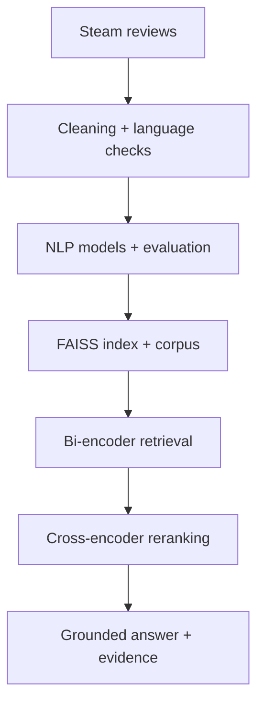

# Steam Review Intelligence — NLP, Explainability & RAG

[](https://github.com/dbechrakis/steam-reviews-nlp-rag/actions/workflows/evidence.yml)

An end-to-end NLP product that transforms large-scale Steam player feedback into sentiment signals, semantic retrieval, explainability, topic analysis, and evidence-grounded answers.

**Stack:** Python · PyTorch · Transformers · Sentence-Transformers · FAISS · SHAP · Groq · FastAPI · Docker · Streamlit

## Live product

**[Open the Steam Game Review Explorer →](https://dbechrakis-steam-explorer.streamlit.app/)**

[](https://dbechrakis-steam-explorer.streamlit.app/)

The application searches a curated corpus of **41,170 reviews across 241 games**. It retrieves semantic candidates, reranks them for relevance, and can generate an answer with numbered review citations through GPT-OSS 120B. Retrieved evidence remains visible when generation is unavailable.

## Decision in 60 seconds

| Question | Evidence | Decision supported | Boundary |
|---|---|---|---|
| What player feedback deserves closer product investigation? | Search and reranking expose original reviews alongside optional cited answers. Historical sentiment modelling reached **0.887 macro F1** on a held-out-game set. | Find recurring complaints or praise, inspect the underlying review excerpts, and form a product hypothesis for further validation. | The five-prompt RAG check measured game-name presence in retrieved evidence, **not** claim-level factuality. No product change or commercial impact was measured. |

For a concrete walkthrough, open the live explorer, ask about a game's player feedback, and inspect the displayed source reviews before using any generated summary. The answer is a research aid, not a verified conclusion about all players.

## Business problem

Large review collections are difficult to use for decisions because feedback is unstructured, repetitive, and spread across many products. This project asks how player feedback can be converted into inspectable evidence for questions such as:

- What is the overall sentiment of player feedback?
- Which themes recur across positive and negative reviews?
- Can relevant reviews be found semantically instead of through keyword matching?
- Which text features influence sentiment predictions?
- Can generated answers remain traceable to real player evidence?

## Product architecture


```mermaid
flowchart TD
    A["Steam reviews"] --> B["Cleaning + language checks"]
    B --> C["NLP models + evaluation"]
    C --> D["FAISS index + corpus"]
    D --> E["Bi-encoder retrieval"]
    E --> F["Cross-encoder reranking"]
    F --> G["Grounded answer + evidence"]
```

The repository separates historical experimentation from the deployed product:

| Layer | Responsibility |
|---|---|
| `notebooks/` | Data preparation, EDA, embeddings, classification, XAI, RAG evaluation, topics |
| `src/steam_review_rag/` | Reusable artifact, retrieval, prompting, diagnostics, and app code |
| `deploy/` | Lean CPU-only Community Cloud entry point and pinned dependencies |
| `outputs/` | Recorded figures and inspectable result tables |
| `tests/` | Fast tests that require no model downloads or API credentials |

See [architecture and contracts](docs/architecture.md) for the runtime boundaries and failure behavior.

**Why this design:** FAISS retrieves candidates, a cross-encoder reranks a bounded set, and the UI keeps the original review excerpts visible alongside optional generation. The [design decisions](docs/architecture.md#design-decisions) explain the latency and evidence trade-offs, provider fallback, and what the small offline evaluation does and does not support.

## Modelling and evaluation

### Sentiment classification

The canonical modelling sample contains 120,000 reviews. DistilBERT was fitted on 86,739 reviews and evaluated on a shared **24,342-review held-out-game test set**, reducing direct game overlap between training and evaluation.

| Model / representation | Accuracy | Macro F1 |
|---|---:|---:|
| TF-IDF | 89.3% | 0.836 |
| Word2Vec | 85.1% | 0.789 |
| Sentence-BERT | 85.0% | 0.786 |
| **Fine-tuned DistilBERT** | **92.9%** | **0.887** |

The original representation comparison used different preprocessing for TF-IDF/Word2Vec and Sentence-BERT. A saved same-text TF-IDF control reached **90.12% accuracy / 0.8484 macro F1**. The table therefore compares complete pipelines; it does not isolate architecture alone.

[Sample accounting](outputs/tables/full_data_and_sample_summary.csv) · [Controlled comparison](outputs/tables/embedding_comparison_controlled.csv)


### RAG evaluation

**New executed retrieval benchmark:** [80 source-backed questions](evaluation/README.md) compare bi-encoder retrieval with reranking, using disjoint development/holdout game sets and pinned model revisions. [Inspect measured results and failure cases](outputs/evaluation/baseline-v1/summary.md). These are target-game and source-anchor diagnostics; GPT-OSS claim support and appropriate abstention remain unmeasured until generation and human adjudication are completed.

The recorded Llama evaluation found **17 of 18 recognized game-name mentions in retrieved evidence** across five prompts. This is a limited name-presence check, not claim-level factuality. It cannot prove that every statement about a correctly named game is supported.

[Generator counts](outputs/tables/rag_model_comparison.csv) · [Retrieval evaluation](outputs/tables/rag_retrieval_eval.csv) · [Evaluation notebook](notebooks/05_RAG_System.ipynb)

These are recorded historical results. The September 2026 review checked saved evidence and evaluation code but did not retrain the transformer or regenerate historical answers.

## Runtime flow

1. Fixed-revision artifacts are downloaded from the original team deployment.
2. File sizes and cryptographic hashes are verified before loading.
3. A SentenceTransformer embeds the user's question.
4. FAISS retrieves candidate reviews.
5. A cross-encoder reranks candidates.
6. The top evidence is shown directly to the user.
7. When a server-side Groq key is configured, GPT-OSS receives the question and selected excerpts and produces a prompted evidence-only answer.

Generation is deliberately optional. Retrieval evidence remains available after provider failures, and safe diagnostics avoid logging prompts, responses, or credentials.

## Repository structure

```text
steam-reviews-nlp-rag/
├── notebooks/                  # Ordered research and modelling workflow
├── src/steam_review_rag/
│   ├── api.py                  # FastAPI retrieval/answer service
│   ├── app.py                  # Streamlit product UI
│   ├── artifacts.py            # Pinned download + integrity checks
│   ├── diagnostics.py          # Safe provider-failure handling
│   ├── prompting.py            # Pure grounded-prompt construction
│   └── retrieval.py            # FAISS retrieval, reranking, generation
├── deploy/                     # Community Cloud entry point + lean requirements
├── outputs/
│   ├── figures/                # Recorded visual evidence
│   └── tables/                 # Inspectable evaluation results
├── scripts/                    # Benchmark runner, evidence checks, regression gate
├── tests/                      # Artifact, prompt, diagnostic, API and gate tests
├── ci/                         # Evidence/syntax validation
├── app.py                      # Backward-compatible local entry point
├── Dockerfile                  # API image with pinned artifacts and models baked in
├── requirements-api.txt        # Lean CPU serving environment
├── pyproject.toml              # Installable package metadata
└── requirements.txt            # Full notebook environment
```

## Run the application locally

For the lean application environment:

```bash
python3 -m venv .venv
source .venv/bin/activate
python -m pip install -r deploy/requirements.txt
PYTHONPATH=src python -m steam_review_rag.artifacts
python -m streamlit run deploy/streamlit_app.py
```

Add `GROQ_API_KEY` through the environment or an untracked `.env` to enable generated answers. Without a key, retrieval and evidence inspection still work.

For the complete notebook environment and required source files, follow [REPRODUCING.md](REPRODUCING.md). Deployment details and operational limitations are documented in [DEPLOYMENT.md](DEPLOYMENT.md).

## Retrieval API

The same two-stage retriever is also served over REST with FastAPI. The service wraps the app's `SteamReviewRAG` backend unchanged, so the API and the Streamlit app cannot drift apart.

```bash
docker build -t steam-review-api .          # bakes the verified corpus, index and pinned model revisions
docker run -p 8000:8000 steam-review-api    # add -e GROQ_API_KEY=... to enable /answer generation
# OpenAPI docs: http://localhost:8000/docs
```

| Endpoint | Purpose |
|---|---|
| `GET /health` | Corpus size, games, device, start-up time, cache hits and misses, whether answers are enabled |
| `GET /games` | The 241 games and their review counts |
| `POST /search` | Question → up to 8 reranked reviews with IDs, verdicts, bi-encoder and cross-encoder scores |
| `POST /answer` | The same evidence plus a grounded GPT-OSS answer. Reports `generation_status` and checks that every `[n]` citation points at supplied evidence |

Design choices:

- **Pinned and offline.** The image verifies the pinned artifacts at build time and serves the model revisions the benchmark measured. At runtime it runs with `HF_HUB_OFFLINE=1`, so it never pulls a different model.
- **Bounded LRU cache.** Repeated questions are cached (keyed on the normalised question and evidence count). This is safe because the corpus and models are fixed.
- **One inference at a time per process.** CPU inference is serialised, which keeps latency predictable.
- **The key never leaves the server.** Unknown request fields are rejected, so a client cannot pass a key. Provider errors become allow-listed diagnostics, and evidence is returned even when generation fails.

### Retrieval regression gate

[`retrieval-gate.yml`](.github/workflows/retrieval-gate.yml) runs on pull requests that touch retrieval code, on a weekly schedule, and on demand:

1. It reruns the 80-question benchmark with the real models.
2. [`check_retrieval_regression.py`](scripts/check_retrieval_regression.py) fails the build if any split/category's target-game precision@5 or coverage@5 falls more than 0.02 below the committed baseline, or if the reranked top-5 sets drift too far (mean Jaccard below 0.8).
3. It builds the Docker image and queries `/search` and `/answer` in the running container.

A change that makes search worse cannot merge silently.

## Validation and guardrails

- Artifacts are pinned to a fixed source revision and validated by size and checksum.
- Corpus schema and FAISS row counts are checked before retrieval.
- Questions are limited to 600 characters with a five-second per-session cooldown.
- Visitors cannot provide or view the server-side API key.
- Provider exception details are converted to allow-listed diagnostics.
- CI validates notebook structure, saved result arithmetic, Python syntax, artifact checks, prompts, and failure messages.
- Generated citations remain fallible and should be checked against the displayed reviews.

See [VALIDATION.md](VALIDATION.md) for exactly what was and was not rerun.

## Contribution and provenance

The original notebooks identify Dimitrios Bechrakis as owner of:

- **Notebook 03:** document embeddings, representation comparison, and semantic search;
- **Notebook 04:** DistilBERT fine-tuning, held-out-game evaluation, and SHAP explanations;
- **Notebook 05:** two-stage retrieval, RAG evaluation, and application-artifact export.

The portfolio edition packages and documents the team's workflow while retaining that attribution. It does not claim sole authorship of the complete academic project or ownership of the teammate-hosted artifacts.

Applied NLP case study developed during the MSc Data Science programme at **The American College of Greece**.

**Dimitris Bechrakis**

Business Analyst | Commercial Analytics · Data Products · Applied Data Science

## Licensing

See the root [MIT license](LICENSE) and [LICENSING.md](LICENSING.md) for covered supplemental code and separately governed team materials/data.
