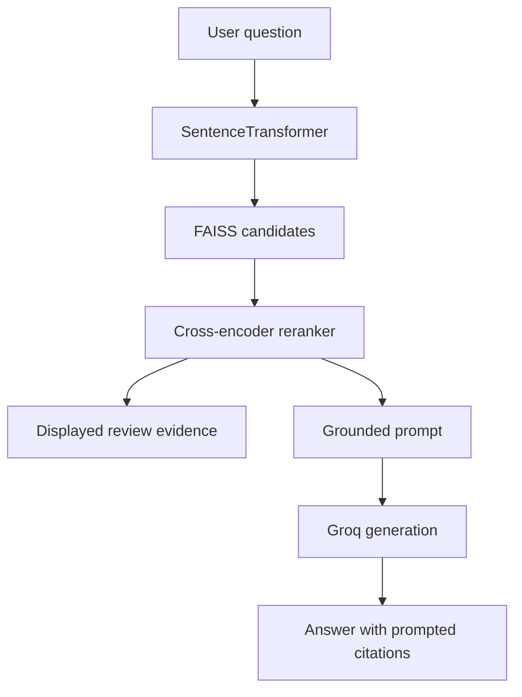

# Architecture and runtime contracts

## Product flow

## Runtime contracts

| Boundary | Contract |
|---|---|
| Artifact source → local storage | Fixed revision, expected byte size, SHA-1/SHA-256 integrity check |
| Corpus → FAISS | Corpus row count must equal `index.ntotal` |
| Corpus → retrieval | Non-empty `game_name`, `review`, and `recommendation` fields |
| Question → retriever | Non-empty normalized question; configurable bounded candidate count |
| Retriever → reranker | Review text paired with the same user question |
| Evidence → prompt | Numbered, whitespace-normalized excerpts truncated to 900 characters each |
| Provider → UI | Generated answer or a safe allow-listed diagnostic; evidence remains visible |

## Trust boundaries

- The retrieval artifacts originate from a teammate's public Hugging Face Space and are not independently archived by this repository.
- Integrity checks establish that matching expected files were downloaded; they do not establish that source reviews are complete or unbiased.
- The generator receives only the selected review excerpts and question, but prompting cannot guarantee claim-level faithfulness.
- Displayed citations make the evidence inspectable; they are not automatic factuality proof.

## Failure behavior

- Missing or mismatched artifacts prevent backend startup.
- Corpus/index misalignment raises before any search is served.
- Empty questions return no candidates.
- Retrieval failures stop the request with a user-safe message.
- Generation failures preserve and display retrieved reviews.
- The app functions in evidence-only mode when no Groq key is configured.
